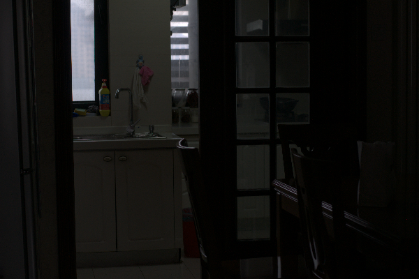
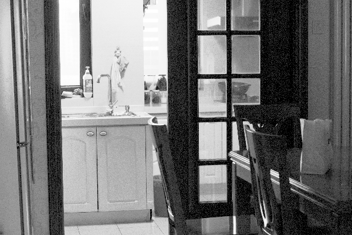
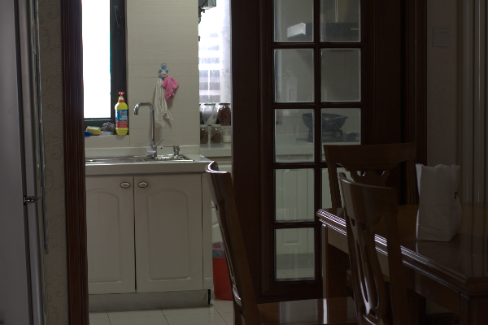

# Image Enhancement Project


> An advanced image enhancement framework that applies CLAHE, Gamma Correction, and Denoising techniques to improve low-quality images with quantitative evaluation against ground truth.

## 📋 Table of Contents
- [Project Purpose and Overview](#project-purpose-and-overview)
- [Setup Instructions and Dependencies](#setup-instructions-and-dependencies)
- [Usage Examples](#usage-examples)
- [Results and Performance Metrics](#results-and-performance-metrics)
- [Contributing](#contributing)
- [Requirements](#requirements)

## Project Purpose and Overview

This project focuses on enhancing low-quality images using advanced image processing techniques such as:
- CLAHE (Contrast Limited Adaptive Histogram Equalization)
- Gamma Correction
- Denoising

The goal is to improve the quality of images and evaluate their performance by comparing the enhanced images to the corresponding high-quality ground truth images. The project calculates and logs the Structural Similarity Index (SSIM) score to provide quantitative assessment of enhancement quality.

## Setup Instructions and Dependencies

### Prerequisites

Ensure that you have the following installed on your system:
- Python 3.x
- OpenCV
- NumPy
- scikit-image
- Matplotlib

### Installation

To set up the project, follow these steps:

1. Clone the repository to your local machine:
   ```bash
   git clone https://github.com/ELZAYDA/Image-Enhancement-Quality-Comparison.git
   ```

2. Navigate to the project directory:
   ```bash
   cd Image-Enhancement-Quality-Comparison
   ```

3. Install the necessary dependencies using pip:
   ```bash
   pip install -r requirements.txt
   ```

### Directory Structure

The project follows this directory structure:

```
Image-Enhancement-Quality-Comparison/
│ 
├── data/                      # Contains input images
│   ├── low/                   # Low-quality input images
│   └── high/                  # High-quality ground truth images
│
├── src/
|   └── notebook.ipynb         # Interactive Jupyter notebook        
│   └── results/               # Results directory
│       ├── enhanced/          # Enhanced output images
│       ├── plots/             # Comparison visualizations and histograms
│       └── metrics/           # SSIM scores and metrics logs
|
├── requirements.txt           # List of dependencies
├── script.py                  # Main image processing script
└── README.md                  # Project documentation
```

## Usage Examples

### Input Images

This project requires two sets of images:
- **Low-quality images** (stored in the `data/low` folder)
- **High-quality ground truth images** (stored in the `data/high` folder)

**Important**: Ensure that the number of low and high-quality images are the same, and they are named consistently to allow proper matching between pairs.

### Example Command

To run the image enhancement and save results, execute the following command:

```bash
python script.py
```

### Output

The output will be saved in the `src/results/` directory:

- **Enhanced Images**: Saved in the `src/results/enhanced/` folder
- **Comparison Plots**: (Original, Enhanced, Ground Truth) saved in the `src/results/plots/` folder
- **SSIM Scores**: Logged in the `src/results/metrics/metrics.csv` file
- **Histograms**: Original, enhanced, and ground truth image histograms saved in the `src/results/plots/` folder

### Example of Input and Output

#### Input (Low-Quality Image):


#### Output (Enhanced Image):


#### Ground Truth (High-Quality Image):


### SSIM Score:

The Structural Similarity Index (SSIM) is calculated to measure the similarity between the enhanced and ground truth images. The SSIM score is logged for each image pair processed.

## Results and Performance Metrics

The project evaluates enhancement quality using the **Structural Similarity Index (SSIM)** between the enhanced image and the corresponding high-quality ground truth image. The SSIM scores are saved in a CSV file for further analysis.

### Example CSV log entry:
```
timestamp,image_name,ssim
2025-05-12 12:34:56,sample_low_image,0.85
2025-05-12 12:35:03,another_image,0.78
2025-05-12 12:35:10,third_image,0.92
```

### SSIM Interpretation

| SSIM Range | Quality Assessment |
|------------|---------------------|
| 0.95 - 1.00 | Excellent enhancement |
| 0.88 - 0.94 | Good enhancement |
| 0.80 - 0.87 | Acceptable enhancement |
| 0.70 - 0.79 | Moderate enhancement |
| < 0.70 | Poor enhancement |


## 🤝 Contributing

Contributions are welcome! Please feel free to submit a Pull Request.

1. Fork the repository
2. Create your feature branch:
   ```bash
   git checkout -b feature/amazing-feature
   ```
3. Commit your changes:
   ```bash
   git commit -m 'Add some amazing feature'
   ```
4. Push to the branch:
   ```bash
   git push origin feature/amazing-feature
   ```


 Open a Pull Request

## 📞 Contact

**Ahmed Nabil** - Engineer & Project Maintainer

[](https://www.linkedin.com/in/ahmed-nabil-452762293/) 
[](https://github.com/ELZAYDA)

- 📧 Email: ahmedelzayda19@gmail.com
- 🔗 Project: [github.com/ELZAYDA/image-enhancement-histogram](https://github.com/ELZAYDA/image-enhancement-histogram)

---

<p align="center">
  Made with ❤️ by Ahmed Nabil
</p>
